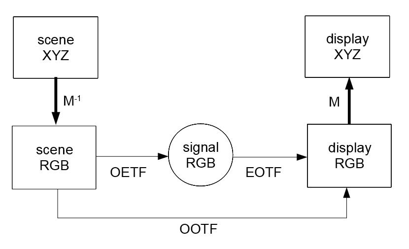
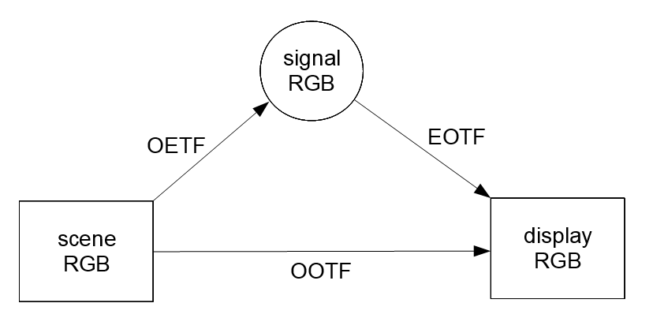
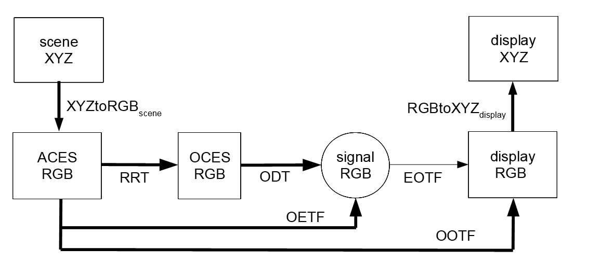

```{r setup, include=FALSE}
knitr::opts_chunk$set(echo = TRUE)
options( width=100 )
library(spacesRGB)
```


RGB spaces are confusing because for each RGB space, up to three RGB vectors are involved:

<ul>
<li>linear _scene RGB_ that represents light from a scene; this is optical in nature</li>
<li>non-linear _signal RGB_ encoded from scene RGB; this is electrical in nature</li>
<li>linear _display RGB_ that represents light emitted from a display; this is optical in nature</li>
</ul>
Without qualification, the non-linear _signal RGB_ is usually meant.
This is the case for `grDevices::rgb()`,
`grDevices::hsv()`,
`grDevices::convertColor()`, etc.
<!-- Sometimes we call "_signal RGB_"  _"display signal RGB"_ for emphasis. -->


There are no strong package dependencies, but these packages are suggested:

<ul>
<li>**spacesXYZ** @spacesXYZ - used in some of the ACES Color transfer functions</li>
<li>**rgl** @rgl - used to make wireframe plots of 3D transfer functions</li>
<li>**microbenchmark** @microbenchmark - for its high-precision timer</li>
</ul>


Similar packages:
Package **colorspace** @colorspace has similar functionality, and is much faster because it
is written in C; but it only supports one RGB space - sRGB.
Package **farver** @farver is also much faster because it
is written in C++.
But it only supports one RGB space, which is probably sRGB.

And speaking of speed, this package is not fast enough to transform millions of RGB pixels.
But it is fast enough to transform a thousand RGB patches;
the function `plotPatchesRGB()` is available for that purpose.
For the complicated ACES Transforms, it is hoped that this **R** package
can be a completely independent check on other implementations.


<br><br>


# Desktop Graphics and Basic Broadcast Television


The 16 RGB working spaces for desktop graphics at Lindbloom @lindbloom,
and basic broadcast television standards (such as BT.709 and BT.2020),
are illustrated in this diagram:

<center>
<br>
<font size=+1>Figure 1.1 - Desktop Graphics, and Broadcast Television</font>
</center>

_Scene XYZ_ is converted to  _scene RGB_ by a 3x3 matrix $M^{-1}$.
The matrix is uniquely determined by the xy chromaticities of the RGB primaries
and the XYZ of the whitepoint (3*2 + 3 = 9 total numbers);
this is a fundamental fact from projective geometry, see @semple1952 page 398.
_Display RGB_ is converted to _display XYZ_ through multiplication by $M$.
In this package $M$ and $M^{-1}$ are computed with full precision;
the matrices that may be published in the standard are not used.
All 4 vectors - _scene RGB_,  _scene XYZ_,
_display RGB_, and _display XYZ_ - 
are called linear because they are all linear functions of the spectral energy distrubution of light.

The XYZ spaces are relative and normalized so that the maximum white has Y=1;
there are no physical units for XYZ.
Compare this with display XYZ in [ACES Color](#aces-color---the-output-side).

The terminology below is mostly taken from 
BT.709 @BT.709, BT.1886 @BT.1886, and BT.2100 @BT.2100. 

In this package, both linear RGB vectors are normalized to the cube [0,1]$^3$;
they are usually thought of as _optical_ in nature.
Signal RGB can be thought of as _electrical_ in nature.
It is common to think of this signal as an 8-bit number stored in the frame buffer,
so the cube [0,255]$^3$ is very commmon for signal RGB.
This package allows the user to specify any positive number as the upper limit of the interval.
The relevant function argument is `maxSignal`.

In the above figure the thin arrows indicate that the transforms are univariate
and operate independently on each channel and in the same way.
These transforms - OETF, EOTF, and OOTF - are called _transfer functions_.
The thick arrows indicate that the transform is multivariate;
in this diagram they are the 3x3 matrix transforms.

The conversion function from optical scene RGB (linear) 
to electrical signal RGB (non-linear) is called the
_Opto-Electronic Transfer Function_ (OETF).
Each primary component (R,G, and B) is transformed independently and has the same OETF.
In this section, the OETF is always defined as a map of [0,1] to itself.
The classical OETF is the "$1/\gamma$ power law".
For Adobe RGB, the OETF is classical with $\gamma = 563/256 \approx 2.2$.
For the most popular RGB space - sRGB - the OETF is a continuous function defined in 2 pieces.
In ICC profiles, the OETF is called a _Tone Response Curve_ (TRC), or _shaper curve_.

All the transfer functions in this section are continuous and strictly increasing functions
that take [0,1] to itself.
All transfer functions in this section  are either power laws, or well-approximated by power laws.
The exponent giving the best match is called the
_effective gamma_, the
_approximate gamma_, or the 
_best-fit exponent_
for the transfer function.
The function `summaryRGB()` displays the _best-fit exponent_ for
the transfer functions of all these basic RGB spaces.

The conversion function from electrical signal RGB (non-linear) 
to optical display RGB (linear) is called the
_Electro-Optical Transfer Function_ (EOTF).
Each primary component (R,G, and B) is transformed independently and has the same EOTF.
The classical EOTF is the "$\gamma$ power law".
That is $R' = R^\gamma$, where $R'$ is display Red and $R$ is signal Red.
In this section, the EOTF is always the inverse of the OETF; i.e. EOTF=OETF$^{-1}$.

The _Opto-optical Transfer Function_ (OOTF) is the OETF followed by the EOTF.
This is called their _composition_ and in this User Guide we will write:
$\text{OOTF} = \text{OETF} \otimes \text{EOTF}$, following BT.2100 @BT.2100.
In the **R** code we use the symbols `*` or `%X%`.
Since EOTF=OETF$^{-1}$, the OOTF is the identity, i.e. trivial.
In some contexts one says that the _system gamma_ is 1,
or that the _end-to-end exponent_ is 1.
This implies that scene RGB and display RGB are the same,
and that scene XYZ and display XYZ are the same.
The OOTF is also called the _system transfer function_.

```{r echo=TRUE, message=FALSE, fig.cap='Figure 1.2  The 3 Transfer Functions of sRGB', fig.align="center", fig.width=4, fig.height=4, dev='png' }
theSpace = getRGB('sRGB')
par( omi=c(0,0,0,0), mai=c(0.6,0.55,0.1,0.1) )
plot( theSpace$OETF, main='', ylab='', color='red' )
plot( theSpace$EOTF, add=TRUE, color='blue' ) ; plot( theSpace$OOTF, add=TRUE, color='black' )
legend( 'topleft', legend=c('OETF','EOTF','OOTF'), bty='n', lwd=2, col=c('red','blue','black') )
```

To summarize, the RGB spaces in this section all have these simplifying properties:
<ol>
<li>The scene primaries and whitepoint are the same as the display primaries and whitepoint.  These are expressed in CIE xy (or possibly XYZ for the whitepoint).
This is equivalent to the fact that the 2 3x3 matrices in Figure 1.1 are inverses of each other.</li>
<li>All transfer functions are univariate, with domain and range the interval [0,1], and operate in the same way on all 3 channels.</li>
<li>The OOTF is the identity, or equivalently, the scene RGB and display RGB vectors are equal.
</ol>

These 3 properties are enjoyed by all 16 working RGB spaces at Lindbloom @lindbloom.
This package includes three of these working spaces:  sRGB, Adobe RGB, and Apple RGB.
The others can be easily added by the user using `installRGB()`,
see **Appendix A** for how this works.
The 3 properties are also enjoyed by these RGB spaces: ProPhoto RGB, BT.709, BT.2020, and 240M,
which are also included.

There are some close similarities between some of these spaces.
BT.709 (created 1990) and sRGB (created 1996)
have the same primaries and whitepoint, but different transfer functions.
sRGB copied its primaries and whitepoint from BT.709.
BT.709 and BT.2020 have very close transfer functions, differing only in precision.
HD+2.4 has the same primaries and OETF as BT.709, but a different EOTF.

Regarding property 3, it turns out that
color reproduction for human vision is better when property 3 is *not* satisfied.
In the next section we present an RGB space with a non-trivial OOTF,
i.e. where the system gamma is *not* 1.

<br><br>


# Advanced Broadcast Television

Due to the  _Hunt effect_ and the _Stevens effect_,
color reproduction for human vision is better when the OOTF is *not* the identity.
For an illustration see BT.2390 @BT.2390 Figure 8, 
and for further discussion see @poynton and @wiki-CAM.
The recommendation in BT.1886 @BT.1886 is to use the OETF from  BT.709 @BT.709
and for the EOTF use a pure power law with $\gamma=2.4$ (with optional black offset).
The resulting RGB space "HD+2.4" is installed like this:
```{r echo=TRUE, message=TRUE }
prim  = matrix( c(0.64,0.33,  0.30,0.60,  0.15,0.06,  0.3127,0.3290), 4, 2, byrow=TRUE )
installRGB( 'HD+2.4', scene=prim, OETF=BT.709.EOTF^-1, EOTF=BT.1886.EOTF(), overwrite=TRUE )  
```
And the resulting transfer functions look like this:
```{r echo=TRUE, message=FALSE, fig.cap='Figure 2.1  The 3 Transfer Functions of HD+2.4', fig.align="center", fig.width=4, fig.height=4, dev='png' }
theSpace = getRGB('HD+2.4')
par( omi=c(0,0,0,0), mai=c(0.6,0.55,0.1,0.1) )
plot( theSpace$OETF, main='', ylab='', color='red' )
plot( theSpace$EOTF, add=TRUE, color='blue' ) ; plot( theSpace$OOTF, add=TRUE, color='black' )
legend( 'topleft', legend=c('OETF','EOTF','OOTF'), bty='n', lwd=2, col=c('red','blue','black') )
```
For the EOTF as given $\gamma = 2.4$ exactly.
For the OETF $\gamma \approx 1/1.96$, and
for the OOTF $\gamma \approx 1.21$ (both are approximate).

To summarize, this advanced RGB space has a non-trivial OOTF, but it still has these 2 simplifying properties:
<ol>
<li>The scene primaries and whitepoint are the same as the display primaries and whitepoint.  These are expressed in CIE xy (or possibly XYZ for the whitepoint).</li>
<li>All transfer functions are univariate, with domain and range the interval [0,1], and operate in the same way on all 3 channels.</li>
</ol>
In section 4 we discuss ACES Color, which satisfies neither of these.
But first, it is useful to discuss the transfer function implementation in more detail.
<br><br><br>


# The `TransferFunction` S3 Class

Like most modern languages, **R** treats functions as "first-class citizens".
This allows us to "package" a function and its inverse function in a single object (a list)
together with the domain and range of the function.
The function must be injective, though this is only checked if the dimension is 1.
What we have just described is a so-called _elementary transfer function_ 
which is not exported and not accessible to the user.
The inverse function is actually optional, and if the dimension is 1 an approximate inverse
is constructed automatically (using `stats::splinefun()`).
The dimension N is determined by the domain and range, which are 2xN matrices.
Each matrix defines a (finite) box in R$^N$.

A `TransferFunction` is a _list_ of elementary transfer functions.
The constructor creates a list of length 1, and longer lists are created with `composition()`
or equivalent infix operators: `*`, `%X%`, `%O%`, etc.
In this User Guide we use only `*` and the symbol $\otimes$ (from BT.2100 @BT.2100).

The package provides a number of built-in `TransferFunction` objects that are
common in desktop publishing, broadcast television, and cinema.
Some of these are _parameterized_, such as the function `power.EOTF()` that takes an
argument for the power-law exponent $\gamma$.
The functions `composition()` and `inverse()` allow building of more complex `TransferFunction`s
from these simpler built-in ones.

Here is a simple example:
```{r echo=TRUE, message=FALSE, fig.cap='Figure 3.1  Building TransferFunctions from Simpler Parts', fig.align="center", fig.width=4, fig.height=4, dev='png' }
# create the squaring function on [0,1]
squaring  = TransferFunction( function(x) {x*x}, sqrt, domain=c(0,1), range=c(0,1) )
par( omi=c(0,0,0,0), mai=c(0.6,0.55,0.1,0.1) )
plot( squaring, main='', color='red' )
plot( inverse(squaring), add=TRUE, color='blue' )  # inverse is sqrt()
#   in the next line, power.EOTF(2) is also squaring, so comp should be identity
comp = squaring * inverse( power.EOTF(2.0) )
plot( comp, add=TRUE, color='black' )    
transfer( comp, seq(0,1,length.out=11) )  # verify that comp is the identity
```
As in the above example, the `transfer()` method is used to actually transform numbers.
Other useful methods are `validate()` to run a sequence of tests,
`print()` to print basic properties (e.g. dimension, domain, and range) and also perform validation,
and
`metadata()` to store user-specific data with the object.
There is `inverse()` which returns the inverse and equivalent postfix operator `^-1`.
See the **man** pages for more `TransferFunction` methods.

All the examples in this section are univariate, but multivariate functions are allowed.
The rules for constructing univariate and multivariate `TransferFunction`s are a little different;
again see the **man** pages.
For multivariate examples, see the next section.

If one takes Figure 1.1 and removes the XYZ spaces,
the remaining spaces form this commutative triangle:

<center>
<br>
<font size=+1>Figure 3.2 - The Three Basic Transfer Functions</font>
</center>

In the function `installRGB()`,
the 3 transfer function arguments - `OETF`, `EOTF`, `OOTF` - can be 'given' or 'not given' (`NULL`).
This yields 8 combinations, but only 6 are valid, as given in this table:

OETF     |  EOTF  |   OOTF  |  `installRGB()` Action
---------|--------|---------|-------------
given      |   given     |   given      | input is INVALID 
given      |  given      |   -  | OOTF := OETF * EOTF
given      |  -     | given |  EOTF := OETF^-1 * OOTF
-  |  given | given  | OETF := OOTF * EOTF^-1
given |  -  | -   | EOTF := OETF^-1 and  OOTF := `identity.TF`
-  |  given | -  | OETF := EOTF^-1 and OOTF := `identity.TF`
-  |  -  | given   | input is INVALID
- |  - | - |   OETF = EOTF = OOTF := `identity.TF`

In the table `NULL` is replaced by `-`.
If all 3 are given, it is INVALID because the triangle may not commute.
If 2 functions are given, the 3rd is computed from those 2.
If only 1 function is given, and it is EOTF or OETF, then it makes sense to make the other one the inverse
of the given one, so that the OOTF is the identity.
If only the OOTF is given, it is INVALID because there is no well-defined way to define the other two.
If none are given, as in the last row,
this might be useful for testing direct conversion between signal RGB and XYZ.
The table contains a few cases where the inverse is used,
but if the corresponding function is not invertible, `installRGB()` fails.

<br><br><br>


# ACES Color - The Output Side

The _Academy Color Encoding System_ is designed to seamlessly integrate digital video from any source,
such as CGI, digital cinema cameras, and scanned celluloid film.
See _Academy Color Encoding System_ @ACES 
and 
_ACES Output Transform Details_  @TB-2018-002.
All the **R** code for this section is based on that in **aces-dev** @aces-dev;
this is ACES v1.1 and subject to revision in the future.

The output side of ACES Color processing, is illustrated in this diagram:

<center>
<br>
<font size=+1>Figure 4.1 - ACES Color Output (display)</font>
</center>

_ACES RGB_  (technically ACES2065-1 color space with AP0 primaries)
is linear and scene-referred, with imaginary primaries, see @ACES.
The complications of getting from camera signal to _ACES RGB_,
often with a preferred camera "look",
is the input (capture) side of ACES (with IDT, LMT, CLF, ...) 
and is currently outside the scope of this package.
Unlike the RGB spaces in sections 1 and 2, these RGB values often exceed 1.0 for ordinary scenes.
A perfect white diffuser in the scene is designed to be encoded with RGB=(1,1,1) and specular highlights
can easily exceed this.

**WARNING**:  What we call (non-linear) **signal RGB** is called **Display RGB** in
_ACES Output Transform Details_  @TB-2018-002.
And what we call (linear) **display RGB** does not appear in @TB-2018-002.

In the above figure the thin arrow for EOTF indicates that the transform is univariate
and operates independently on each channel and in the same way.
Exception: the EOTF in the last transform in **Appendix B** - the hybrid log-gamma  - is multivariate.
For the other transforms, he thick arrows indicate that they are multivariate and 3D.

OCES RGB (Output Color Encoding Specification RGB)
is display-referred but the display is not real - it is theoretical.
This theoretical display has a dynamic range of 100 million to 1 and can reproduce any color.
It uses the same imaginary AP0 primaries as ACES RGB.

The RRT is the _Reference Rendering Transform_ from ACES to OCES;
it is _fixed_ and 
<blockquote>
"... the RRT is intended to account for the perceptual factors required to convert the scene referred 
ACES images to an output referred encoding associated with an very high dynamic range, 
extremely wide color gamut device in a dark surround." - Alex Forsythe @quoteRRT
</blockquote>

The ODT is the _Output Device Transform_ for a real device.
It includes the display primaries and whitepoint and other factors.
Real world displays will still need calibration to exactly match the ideal color space of each ODT.

The ODT may be split further
using the concept of a _Partial Output Device Transform_ or PODT, which is unique to this package.
The split is $\text{ODT} = \text{PODT} \otimes  \text{EOTF}^{-1}$ for some standard $\text{EOTF}$.
The function `general.PODT()` returns a PODT which is used for all of the ODT examples in Section 7.1.
In these examples
$\text{OETF} = \text{RRT} \otimes \text{ODT} = \text{RRT} \otimes \text{PODT} \otimes \text{EOTF}^{-1}$.
This ODT split is not shown in the above figure.

In the examples in Section 7.2, the OOTF and EOTF are given and
$\text{OETF} := \text{OOTF} \otimes \text{EOTF}^{-1}$.
The function `general.OOTF()` is used for these examples, and there is no explicit RRT or ODT.

Since the display primaries and whitepoint are different than those of ACES RGB,
the matrices $\text{XYZtoRGB}_\text{scene}$ and $\text{RGBtoXYZ}_\text{display}$ are
**not** inverses of each other, as they are in Figure 1.1.
Another difference with Figure 1.1 is that ACES **display XYZ** has physical units;
the Y coordinate has units of $cd/m^2$ (aka $nit$).

Because of the complexity of ACES Color, calling a single instance of ACES an RGB "space"
does not really do it justice.
A more appropriate name might be an RGB "workflow" or "pipeline".

## Acknowledgements

I would like to thank Scott Dyer for supplying the high-precision data
in the file `test_values.txt` in the folder `tests`,
and Alex Forsythe for his encouragement to "dig into" ACES.


<br><br>
<br><br>

# References

<div id="refs"></div>


<br><br>

\Appendix


<br><br>

# Appendix A - Built-in RGB Spaces

The package comes with a dictionary of 8 built-in RGB spaces; which are loaded from `sysdata.rda`.
The code below shows how they are installed in that dictionary.
Note that the argument `scene` can be a 4x2 matrix, or a list with a 6-vector and a 2-vector.
Also note that the argument `display` is omitted, and the data is copied from `scene`.
For details on this, see the man page for `installRGB()`.

**sRGB**
<pre>
installRGB( 'sRGB', scene=REC709_PRI, EOTF=sRGB.EOTF )
</pre>

<br>
**AdobeRGB**
<pre>
prim    = c(0.64,0.33,  0.21,0.71,  0.15,0.06)
white   = c( 0.3127, 0.3290 )      # D65
installRGB( 'AdobeRGB', scene=list(prim,white), EOTF=563/256 )
</pre>


<br>
**ProPhotoRGB**
<pre>
prim    = c(0.7347,0.2653,  0.1596,0.8404,  0.0366,0.0001)
white   = c( 0.3457,0.3585 )    # D50
installRGB( 'ProPhotoRGB', scene=list(prim,white), EOTF=ProPhotoRGB.EOTF )
</pre>

<br>
**AppleRGB**
<pre>
prim    = c(0.625,0.34,  0.28,0.595, 0.155,0.07)
white   = c( 0.3127, 0.3290 ) 
installRGB( 'AppleRGB', scene=list(prim,white), EOTF=1.8 )
</pre>

<br>
**BT.709**
<pre>
installRGB( 'BT.709', scene=REC709_PRI, EOTF=BT.709.EOTF )
</pre>

<br>
**BT.2020**
<pre>
installRGB( 'BT.2020', scene=REC2020_PRI, EOTF=BT.2020.EOTF )
</pre>

<br>
**240M**
<pre>
prim    = c(0.64,0.34,  0.31,0.595,  0.155,0.07 )
white   = c( 0.3127, 0.3290 )
installRGB( '240M', scene=list(prim,white), EOTF=SMPTE.240M.EOTF )
</pre>

<br>
**HD+2.4**
<pre>
installRGB( "HD+2.4", scene=REC709_PRI, OETF=BT.709.EOTF^-1, EOTF=2.4 )  
</pre>


  


<br><br>

# Appendix B - Sample ODTs and Output Transforms for ACES

This Appendix has **spacesRGB** expressions for the output transforms available as 
presets to the user in ACES v1.1, see _ACES Output Transform Details_ @TB-2018-002.
<!-- These 21 transforms are divided into 2 groups depending on how the three basic transforms are defined. -->
<!-- Each group defines two of the transforms, and the third one is determined by the other two. -->
 
For examples of these transforms "in action" see the files 
`test-ACES.R` and `test_values.txt` in the folder `tests`. 
 
## Output Transforms with given OETF and EOTF

In @TB-2018-002 Sections 5.1 to 7.2 are 16 Output Transforms
whose transfer functions are defined by their OETF and EOTF,
and then $\text{OOTF} := \text{OETF} \otimes \text{EOTF}$.
These tables present the OETF and EOTF using the S3 `TransferFunction` objects available in **spacesRGB**.
The display primaries and whitepoints are easily extracted from the expressions for the OETF.
Note that in the case of DCDM (Digital Cinema Distribution Master) in sections 5.7-9, 
which uses XYZ as its primaries, the argument `display_pri=NULL`.


Section 5.1 | P3-D60
------------|--------------
ACES Transform ID | `ODT.Academy.P3D60 48nits.a1.0.3`
OETF              | `RRT.TF *  general.PODT( P3D60_PRI, Ymax=48 ) * power.OETF( 2.6 )`
EOTF              | `power.EOTF( 2.6 )`


Section 5.2 | P3-D65
------------|--------------
ACES Transform ID | `ODT.Academy.P3D65 48nits.a1.1`
OETF              | `RRT.TF *  general.PODT( P3D65_PRI, Ymax=48 ) * power.OETF( 2.6 )`
EOTF              | `power.EOTF( 2.6 )`


Section 5.3 | P3-D65 (D60 Simulation)
------------|--------------
ACES&nbsp;Transform&nbsp;ID | `ODT.Academy.P3D65 D60sim 48nits.a1.1`
OETF    | `RRT.TF`&nbsp;`*`&nbsp;`general.PODT(P3D65_PRI,Ymax=48,observer=P3D60_PRI['W',]) * power.OETF(2.6)`
EOTF    | `power.EOTF( 2.6 )`


Section 5.4 |  P3-D65 (Rec. 709 Limited)
------------|--------------
ACES&nbsp;Transform&nbsp;ID | `ODT.Academy.P3D65 Rec709limited 48nits.a1.1`
OETF              | `RRT.TF * general.PODT(P3D65_PRI,Ymax=48,limiting_pri=REC709_PRI) * power.OETF(2.6)`
EOTF              | `power.EOTF( 2.6 )`


Section 5.5 |  P3-DCI (D60 Simulation)
------------|--------------
ACES&nbsp;Transform&nbsp;ID | `ODT.Academy.P3DCI D60sim 48nits.a1.1`
OETF              | `RRT.TF * general.PODT(P3DCI_PRI,Ymax=48,observer=P3D60_PRI['W',]) * power.OETF(2.6)`
EOTF              | `power.EOTF( 2.6 )`


Section 5.6 |  P3-DCI (D65 Simulation)
------------|--------------
ACES&nbsp;Transform&nbsp;ID | `ODT.Academy.P3DCI D65sim 48nits.a1.1`
OETF              | `RRT.TF * general.PODT(P3DCI_PRI,Ymax=48,observer=P3D65_PRI['W',]) * power.OETF(2.6)`
EOTF              | `power.EOTF( 2.6 )`


Section 5.7 |  DCDM
------------|--------------
ACES Transform ID | `ODT.Academy.DCDM.a1.0.3`
OETF              | `RRT.TF * general.PODT(NULL,Ymax=48) * DCDM.EOTF^-1`
EOTF              | `DCDM.EOTF`


Section 5.8 |  DCDM (P3-D60 Limited)
------------|--------------
ACES&nbsp;Transform&nbsp;ID | `ODT.Academy.DCDM P3D60limited.a1.1`
OETF              | `RRT.TF * general.PODT(NULL,Ymax=48,limiting_pri=P3D60_PRI) * DCDM.EOTF^-1`
EOTF              | `DCDM.EOTF`


Section 5.9 |  DCDM (P3-D65 Limited)
------------|--------------
ACES&nbsp;Transform&nbsp;ID | `ODT.Academy.DCDM P3D65limited.a1.1`
OETF              | `RRT.TF * general.PODT(NULL,Ymax=48,limiting_pri=P3D65_PRI) * DCDM.EOTF^-1`
EOTF              | `DCDM.EOTF`


Section 6.1 |  Rec.709
------------|--------------
ACES&nbsp;Transform&nbsp;ID | `ODT.Academy.Rec709 100nits dim.a1.0.3`
OETF              | `RRT.TF * general.PODT(REC709_PRI,Ymax=100,surround='dim')  * BT.1886.EOTF()^-1`
EOTF              | `BT.1886.EOTF()`

Section 6.2 |  Rec.709 (D60 Simulation)
------------|--------------
ACES&nbsp;Transform&nbsp;ID | `ODT.Academy.Rec709 D60sim 100nits dim.a1.0.3`
OETF              | `RRT.TF * general.PODT(REC709_PRI,Ymax=100,observer=P3D60_PRI['W',],surround='dim') * BT.1886.EOTF()^-1`
EOTF              | `BT.1886.EOTF()`


Section 6.3 |  Rec.2020
------------|--------------
ACES&nbsp;Transform&nbsp;ID | `ODT.Academy.Rec2020 100nits dim.a1.0.3`
OETF              | `RRT.TF * general.PODT(REC2020_PRI,Ymax=100,surround='dim') * BT.1886.EOTF()^-1`
EOTF              | `BT.1886.EOTF()`


Section 6.4 |  Rec.2020 (P3-D65 Limited)
------------|--------------
ACES&nbsp;Transform&nbsp;ID | `ODT.Academy.Rec2020 P3D65limited 100nits dim.a1.1`
OETF              | `RRT.TF * general.PODT(REC2020_PRI,Ymax=100,limit=P3D65_PRI,surround='dim') * BT.1886.EOTF()^-1`
EOTF              | `BT.1886.EOTF()`


Section 6.5 |  Rec.2020  (Rec.709 Limited)
------------|--------------
ACES&nbsp;Transform&nbsp;ID | `ODT.Academy.Rec2020 P3D65limited 100nits dim.a1.1`
OETF              | `RRT.TF * general.PODT(REC2020_PRI,limit=REC709_PRI,surround='dim') * BT.1886.EOTF()^-1`
EOTF              | `BT.1886.EOTF()`


Section 7.1  | sRGB
-------------|-------------------------
ACES&nbsp;Transform&nbsp;ID | `ODT.Academy.RGBmonitor 100nits dim.a1.0.1`
OETF              | `RRT.TF * general.PODT(REC709_PRI,Ymax=100,surround='dim') * sRGB.EOTF^-1`
EOTF              | `sRGB.EOTF`


Section 7.2  | sRGB (D60 Simulation)
-------------|-------------------------
ACES&nbsp;Transform&nbsp;ID | `ODT.Academy.RGBmonitor D60sim 100nits dim.a1.0.1`
OETF              | `RRT.TF * general.PODT(REC709_PRI,Ymax=100,observer=P3D60_PRI['W',],surround='dim') * sRGB.EOTF^-1`
EOTF              | `sRGB.EOTF`


None of these are pre-installed in the package.
The resulting RGB space for last one - **sRGB (D60 Simulation)** - can be installed like this:
```{r echo=TRUE, message=TRUE }
OETF = RRT.TF * general.PODT(REC709_PRI,observer=P3D60_PRI['W',],surround='dim') * sRGB.EOTF^-1 
installRGB( 'sRGB_D60sim', scene=AP0_PRI, EOTF=sRGB.EOTF, OETF=OETF )
```
And the other 15 spaces can be installed in a similar way.
Note that the display primaries `REC709_PRI` do not have to be passed to `installRGB()`,
since they are automatically picked from the metadata of the OETF.
See the man page for `installRGB()`.

<br><br>


## Output Transforms with given OOTF and EOTF

In  @TB-2018-002 Sections 8.1 to 9.4 are 5 Output Transforms 
whose transfer functions are defined by their OOTF and EOTF, and then
$\text{OETF} := \text{OOTF} \otimes \text{EOTF}^{-1}$.
These tables present the OOTF and EOTF using the S3 `TransferFunction` objects available in **spacesRGB**.
The display primaries and whitepoints are easily extracted from the expressions for the OOTF.

Section 8.1       | P3-D65 ST2084 (108 nits)
------------------|------
ACES Transform ID | `RRTODT.Academy.P3D65 108nits 7.2nits ST2084.a1.1`
OOTF              | `general.OOTF( disp=P3D65_PRI, Ymid=7.2, Ymax=108 )`
EOTF              | `PQ.EOTF(10000/108)`


Section 9.1       | Rec.2020 ST2084 (1000 nits)
------------------|------
ACES Transform ID | `RRTODT.Academy.Rec2020 1000nits 15nits ST2084.a1.1`
OOTF              | `general.OOTF( disp=REC2020_PRI, Ymid=15, Ymax=1000 )`
EOTF              | `PQ.EOTF(10000/1000)`


Section 9.2       | Rec.2020 ST2084 (2000 nits)
------------------|------
ACES Transform ID | `RRTODT.Academy.Rec2020 2000nits 15nits ST2084.a1.1`
OOTF              | `general.OOTF( disp=REC2020_PRI, Ymid=15, Ymax=2000 )`
EOTF              | `PQ.EOTF(10000/2000)`


Section 9.3       | Rec.2020 ST2084 (4000 nits)
------------------|------
ACES Transform ID | `RRTODT.Academy.Rec2020 4000nits 15nits ST2084.a1.1`
OOTF              | `general.OOTF( disp=REC2020_PRI, Ymid=15, Ymax=4000 )`
EOTF              | `PQ.EOTF(10000/4000)`


Section 9.4       | Rec.2020 HLG (1000 nits)
------------------|------
ACES Transform ID | `RRTODT.Academy.Rec2020 1000nits 15nits HLG.a1.1`
OOTF              | `general.OOTF( disp=REC2020_PRI, Ymid=15, Ymax=1000 )`
EOTF              | `HLG.OETF()^-1  *  HLG.OOTF(Lw=1000/1000)`


In the final one, `HLG.OETF()` is univariate and `HLG.OOTF(Lw=1)` is multivariate with dimension 3.
Thus the EOTF also has dimension 3.
This is the only one of the 21 preset transforms that has a multivariate EOTF.
The resulting RGB space can be installed like this:
```{r echo=TRUE, message=TRUE }
installRGB( 'Rec.2020_HLG', scene=AP0_PRI, OOTF=general.OOTF(REC2020_PRI,Ymid=15,Ymax=1000),
						EOTF=HLG.OETF()^-1 * HLG.OOTF(Lw=1) )
```
And the other 4 spaces can be installed in a similar way.
Note that the display primaries `REC2020_PRI` do not have to be passed to `installRGB()`,
since they are automatically picked from the metadata of the OOTF.
See the man page for `installRGB()`.


<br><br>

# Session Information

<pre>
```{r, echo=FALSE, results='asis'}
sessionInfo()
```
</pre>
